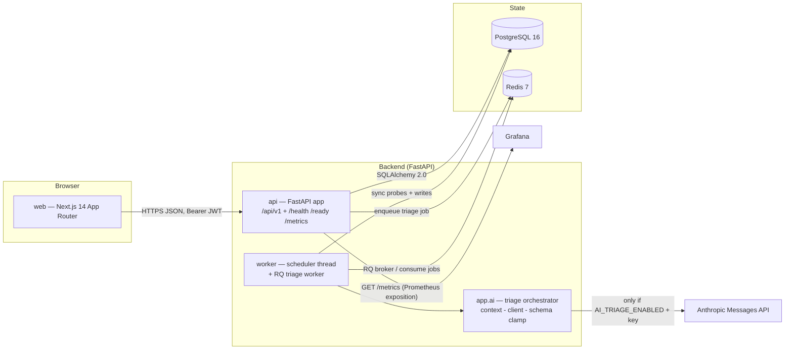
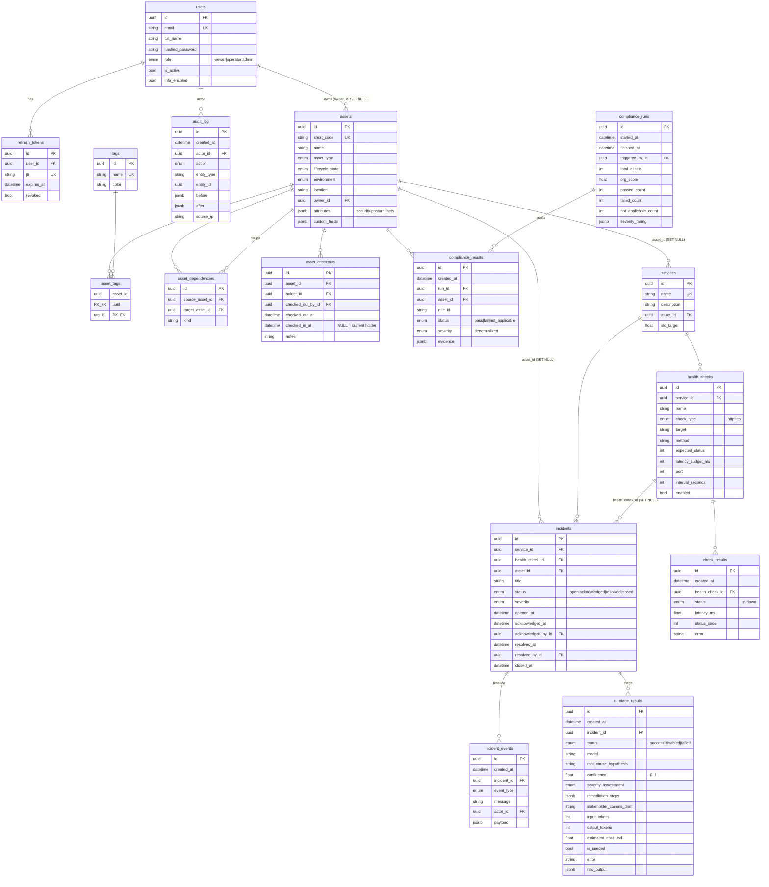
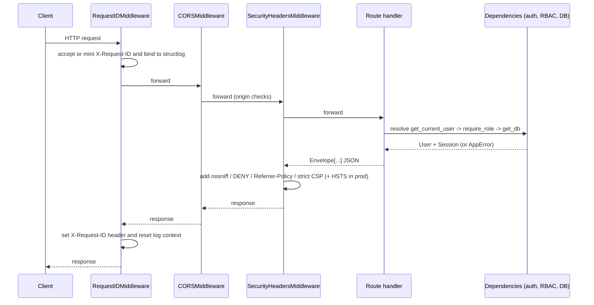
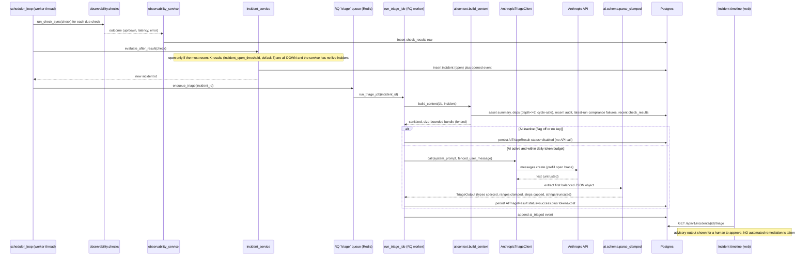

# SentryOps Architecture

SentryOps is a self-hosted IT operations command center. It collapses four disciplines that normally live in four separate tools into a single product backed by one data model: a CMDB (asset inventory plus a directed dependency graph), a security compliance engine, service observability (synthetic health checks and incidents), and AI-assisted incident triage.

## Why one data model shortens MTTR

Fragmentation is the thing that inflates mean-time-to-resolution. When an on-call engineer has to hop between a CMDB, a compliance dashboard, a status page, and a ticketing system, they spend their first minutes reconstructing context by hand: what is this asset, what depends on it, what changed recently, and is it compliant. SentryOps keeps all of that in one Postgres schema, so each pillar feeds the next:

| Pillar | What it owns | How it feeds MTTR |
|--------|--------------|-------------------|
| **CMDB** | `assets`, `tags`, `asset_dependencies`, `asset_checkouts` | The asset inventory and its directed dependency graph are the substrate for blast-radius reasoning. |
| **Compliance** | `compliance_runs`, `compliance_results`, plus the in-code rule registry | A severity-weighted org score and per-asset drift answer "is this asset in a known-bad posture" without a separate scan tool. |
| **Observability** | `services`, `health_checks`, `check_results`, `incidents`, `incident_events` | Synthetic probes detect failures and open incidents automatically, so detection is not a human step. |
| **Audit** | `audit_log` (append-only) | A single chronological "what changed" stream, queried by both compliance and triage. |
| **AI triage** | `ai_triage_results` | The capstone: it reads the unified model (asset, dependencies, recent audit, compliance failures, check history) to draft a root-cause hypothesis for a human to approve. |

Every pillar exists to shorten the path from "something broke" to "here is the likely cause and the fix." The AI layer is optional and advisory; it is flag-gated and off by default.

## System diagram

The `api` and `worker` services build from the same `backend/` image. The worker runs a scheduler thread (`app.workers.run.scheduler_loop`) alongside an RQ `Worker` consuming the `triage` queue. Redis is both the RQ broker and a rollup cache. The `/metrics` endpoint is plain Prometheus exposition (no response envelope) that a Grafana instance scrapes.

## Entity-relationship model

The ERD below reflects the real tables defined under `backend/app/models`. Primary keys are application-generated UUIDs (`UUIDMixin`); most tables carry server-managed `created_at`/`updated_at` (`TimestampMixin`), except the append-only `audit_log` and the time-series/result tables, which carry only `created_at`.

A few model facts worth calling out, because they drive behavior elsewhere:

- `assets.attributes` is the JSONB bag of security-posture facts the compliance rules read. A missing key means "cannot assess," never "non-compliant."
- `asset_dependencies` is a directed adjacency table (`source` depends on `target`) with a `UniqueConstraint(source, target)` and a `CheckConstraint(source <> target)` so an edge cannot be duplicated and an asset cannot depend on itself.
- `asset_checkouts` models check-in/out as an event log: the current holder is the row whose `checked_in_at IS NULL`.
- `compliance_results.severity` is denormalized from the rule definition so historical results survive later edits to a rule's severity.
- `incidents.asset_id` and `incidents.health_check_id` are denormalized links (both `SET NULL` on delete) so triage and blast-radius queries do not have to re-join through the service.

## Request lifecycle

Middleware is registered in `app.main.create_app`. Starlette runs middleware in reverse registration order, so the effective request path is:

1. **Request ID.** `RequestIDMiddleware` accepts an inbound `X-Request-ID` or mints one, stores it on `request.state.request_id`, binds it into the structlog context for the duration of the request, and echoes it back on the response header. It is the outermost middleware so every log line is tagged.
2. **CORS.** `CORSMiddleware` enforces the configured origin allowlist (`cors_origins`, default `http://localhost:3000`) and exposes `X-Request-ID`.
3. **Security headers.** `SecurityHeadersMiddleware` sets `X-Content-Type-Options: nosniff`, `X-Frame-Options: DENY`, `Referrer-Policy: strict-origin-when-cross-origin`, a `Permissions-Policy` that disables camera/microphone/geolocation, and a strict `Content-Security-Policy` (`default-src 'none'; frame-ancestors 'none'`, because the API serves JSON only). `Strict-Transport-Security` is added only when `environment == production`.
4. **Auth dependency.** `get_current_user` (in `app/api/deps.py`) reads the bearer token, decodes it, requires `type == "access"`, parses the `sub` claim as a UUID, and loads an active `User`. Anything wrong raises `AuthError` (401).
5. **RBAC dependency.** `require_role(required)` is a dependency factory. Roles are an ordered enum (`viewer < operator < admin`) with a `can_act_as` check; mutating routes declare `RequireOperator` or `RequireAdmin`. Authorization lives at the API boundary, not the UI, so it holds regardless of the calling client.
6. **Envelope response.** Domain endpoints return `Envelope[T]` (`app/schemas/common.py`): `{ success, data, error, meta }`. List endpoints wrap `Page[T]` inside the envelope. Platform endpoints (`/health`, `/ready`, `/metrics`) intentionally bypass the envelope.
7. **Typed exceptions.** Handlers registered by `register_exception_handlers` map `AppError` subclasses (`NotFoundError` 404, `ConflictError` 409, `PermissionDeniedError` 403, `AuthError` 401, `ValidationAppError` 422, `FeatureDisabledError` 409) and FastAPI/Starlette errors onto the same error envelope, always including the request ID. The catch-all logs full context server-side and returns a generic 500 body so internal detail never leaks.

## Incident-to-AI-triage data flow

Detection and triage are fully automated up to the point of human review. The scheduler thread probes due checks; the incident service decides when to open; an RQ job builds context and calls the model; the clamped output is persisted and rendered on the incident timeline.

Key properties of this path, verified against the code:

- **Opening is debounced.** `incident_service.evaluate_after_result` opens an incident only when the most recent `incident_open_threshold` (default 3) check results are all `down` *and* the service has no live (open or acknowledged) incident. Recovery is the mirror image: the most recent `incident_close_threshold` (default 2) results all `up` auto-resolves and closes the live incident.
- **The feature flag is a hard gate.** `Settings.ai_active` is `ai_triage_enabled AND a key is present`. When inactive, `run_triage` persists an `AITriageResult` with `status=disabled` and an explanatory `error`, records the event, and returns. It never raises and never calls the API. There is also a hard daily token budget (`ai_daily_token_budget`, default 200,000) checked before any call.
- **The model is untrusted at both ends.** Context is fenced (`<<<SECTION ... >>>END_SECTION`) and the system prompt instructs the model to treat fenced content strictly as data. The model's reply is then run through `_extract_json_object` (scan for a brace-balanced object) and `TriageOutput.parse_clamped`, which coerces types, clamps `confidence` to 0..1 and `priority` to 1..5, caps `remediation_steps` at 8, truncates long strings, and rejects irrecoverable output with `ValidationAppError`.
- **Human in the loop.** Output is advisory only. It triggers no automated action; an operator reads the timeline and decides. Seeded demo incidents carry illustrative triage flagged `is_seeded=True` so dashboards look alive with zero API spend.
- **No secrets in logs.** The Anthropic key is handed only to the SDK constructor; neither the key nor the prompt body is ever logged. On failure, the persisted `error` and the structlog line carry only the exception type and message, truncated.

## The composite indexes that matter

Two composite indexes are deliberate, because they serve the two hottest read paths in the product. Both are leading-column-narrows-then-time-orders indexes.

**`check_results (health_check_id, created_at)`** — `Index("ix_check_results_check_recent", ...)`. Every uptime and SLO computation asks the same shape of question: "all results for *this* check within the last 24h / 7d / 30d." The leading `health_check_id` narrows to a single check; the trailing `created_at` lets Postgres range-scan the time window and serve the newest-first ordering without a sort. `check_results` is the highest-write, highest-read table in the system (one row per check per interval), so this is the workhorse index. The incident open/recover logic and the triage context's recent-check lookup ride the same index.

**`audit_log (entity_type, entity_id, created_at)`** — `Index("ix_audit_entity_recent", ...)`. The audit log is append-only and grows without bound, but the two consumers that read it want only "the most recent N changes for one specific entity": the per-entity history view in the UI, and the AI context bundle's "what changed recently" section. Leading on `(entity_type, entity_id)` pins the query to one entity; the trailing `created_at` serves the `ORDER BY created_at DESC LIMIT N`. Without this composite, those reads would degrade to a scan-and-sort over an ever-growing table.

The same pattern appears on `compliance_results (asset_id, created_at)` (`ix_compliance_results_asset_recent`) for per-asset history, on `(run_id, asset_id)` for report assembly, on `incidents (status, opened_at)` for the open-incident board, and on `asset_checkouts (asset_id, checked_in_at)` for the "who currently holds asset X" lookup. The principle is consistent: put the equality-filtered columns first and the range/ordering column last.
