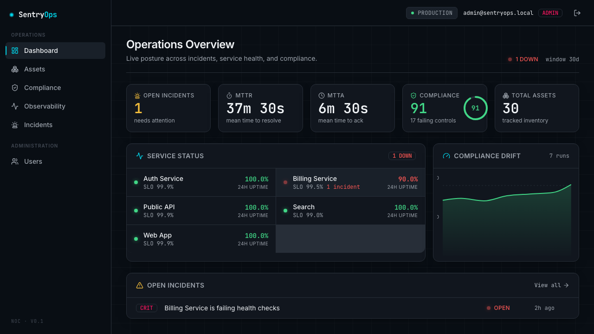
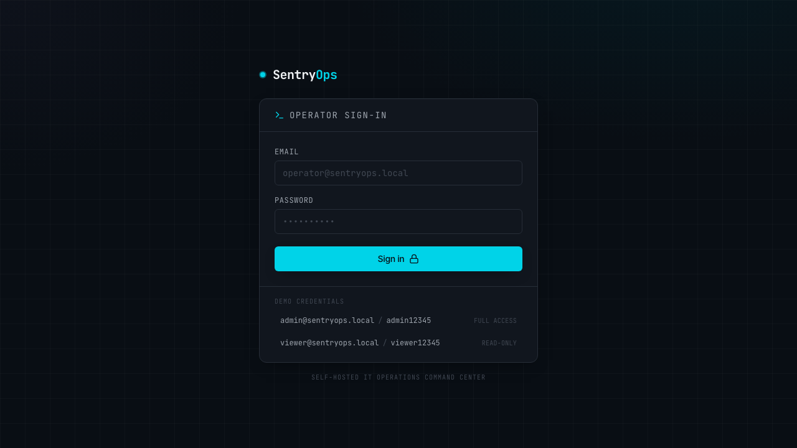
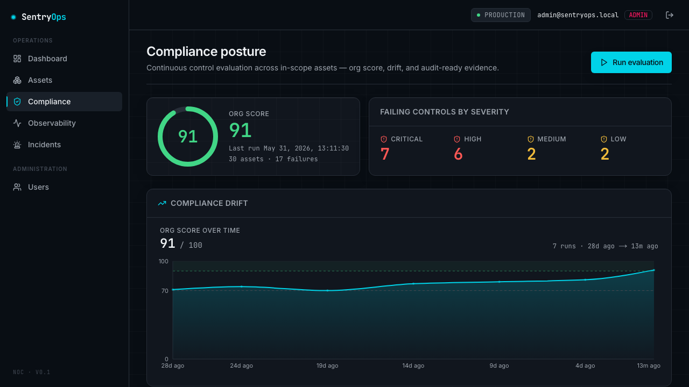
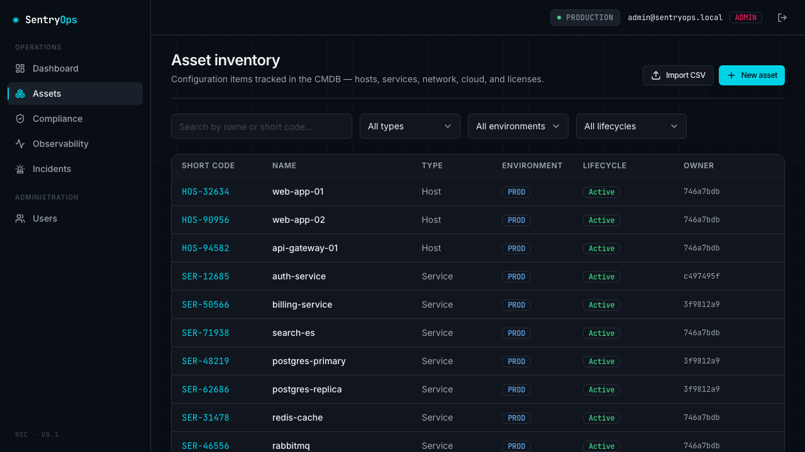
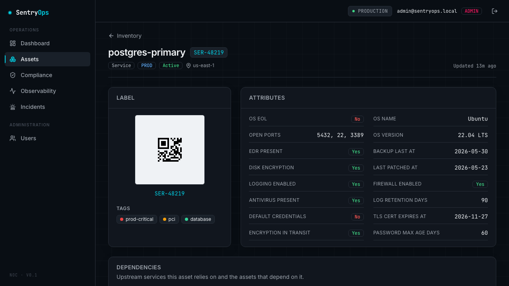
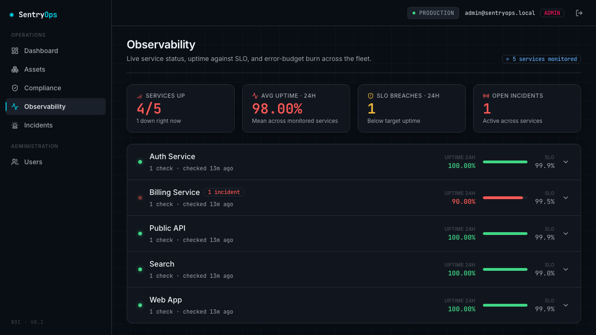
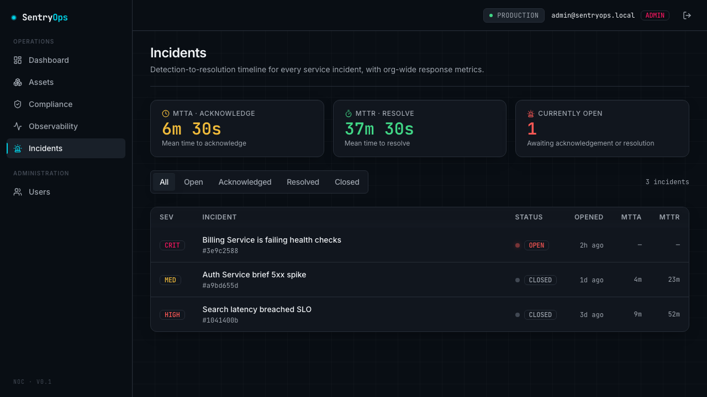
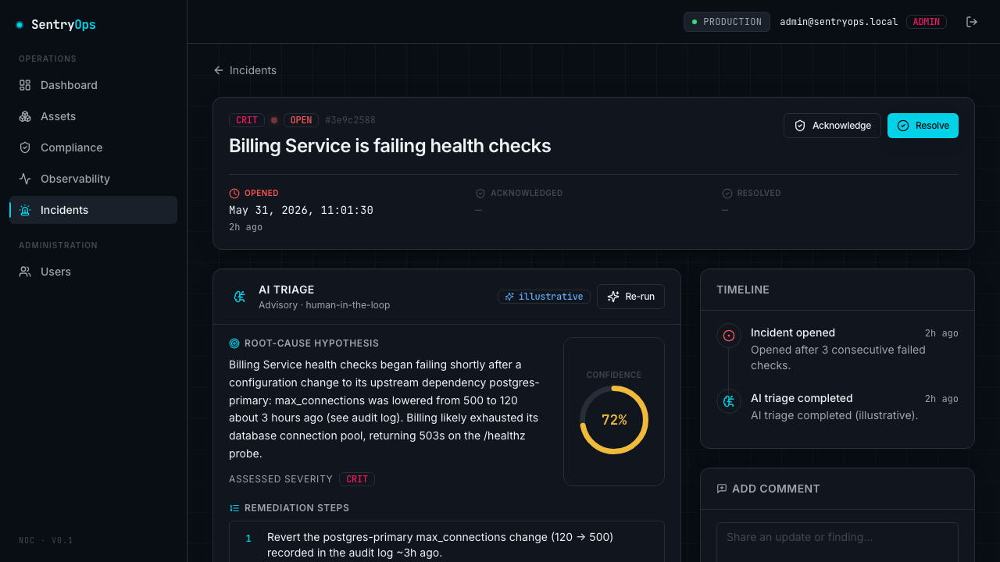
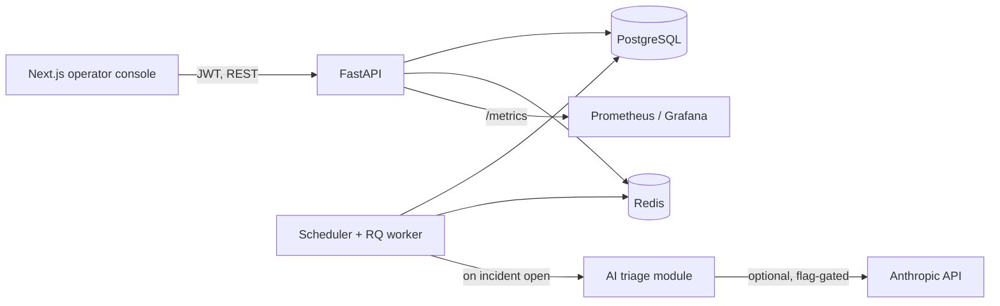

<div align="center">

# SentryOps

### Self-hosted IT operations command center — one pane of glass for asset inventory, compliance, service health, and AI-assisted incident triage.

[](https://github.com/rayancheca/sentryops/actions/workflows/lint.yml)
[](https://github.com/rayancheca/sentryops/actions/workflows/typecheck.yml)
[](https://github.com/rayancheca/sentryops/actions/workflows/test.yml)
[](https://github.com/rayancheca/sentryops/actions/workflows/build.yml)
[](https://github.com/rayancheca/sentryops/actions/workflows/security.yml)


</div>

SentryOps is an operator console that collapses four fragmented IT disciplines into a single product backed by one data model: a **CMDB** (asset inventory + dependency graph), a **compliance engine** (CIS/NIST control scoring with drift), **observability** (synthetic health checks, SLOs, incidents, MTTA/MTTR), and an optional **AI incident-triage** agent. Everything runs on your own infrastructure with one command.



> The NOC overview: live MTTA/MTTR, organization compliance score, a service status wall, the compliance drift trend, and open incidents — all seeded so a fresh clone looks alive.

---

## Why it exists

Small and mid-sized IT teams operate across five or more disconnected tools: a spreadsheet for asset inventory, a separate scanner for compliance posture, a monitoring dashboard for uptime, and a ticket queue for incidents. When something breaks, the on-call engineer has to manually correlate "what asset is this, what depends on it, what changed recently, and is it even compliant?" across four browser tabs. MTTR is high, compliance drift goes unnoticed until an audit, and tribal knowledge lives in people's heads.

SentryOps unifies those four things into one self-hosted pane of glass. The asset inventory feeds the dependency graph; the dependency graph and the immutable audit log feed blast-radius and "what changed"; the compliance engine answers "is this allowed"; observability detects failures and opens incidents automatically; and the AI agent reads that unified model to draft a root-cause hypothesis for a human to approve. Every feature traces back to reducing fragmentation and lowering MTTR.

---

## Feature tour

A walkthrough of the golden path, captured from the running app with seeded data (`make demo`). Demo credentials are at the bottom.

### 1. Sign in — RBAC with three roles

Argon2-hashed passwords, JWT access/refresh with rotation, and three roles (admin, operator, viewer) enforced **at the API layer**, not just the UI.



### 2. Compliance posture and drift

A data-driven engine evaluates every active asset against **16 controls** mapped to CIS Benchmarks and NIST SP 800-53 families. Each run is a snapshot, so the org score is tracked over time and newly-failing controls are flagged since the last run. The report is audit-ready.



### 3. Asset inventory (CMDB)

Hosts, network devices, services, licenses, and cloud resources with lifecycle state, ownership, tags, and flexible JSONB attributes. Filterable and keyboard-navigable.



### 4. Asset detail — dependencies, QR label, posture

Every asset carries a printable QR label, its security-posture attributes (the inputs to compliance), and its upstream/downstream dependency tree. The dependency graph is what the AI agent later walks to reason about blast radius.



### 5. Service observability

Synthetic HTTP/TCP checks run on a schedule. SentryOps computes uptime over 24h/7d/30d, tracks an SLO target and error-budget burn per service, and renders a status-page-style grid. A Prometheus `/metrics` endpoint and a ready-to-import Grafana dashboard ship in [`docs/grafana/`](docs/grafana/).



### 6. Incidents with MTTA / MTTR

When a check fails for K consecutive runs an incident opens automatically (and closes on recovery). Acknowledge and resolve timestamps drive **mean-time-to-acknowledge** and **mean-time-to-resolve**, the KPIs IT leaders are measured on.



### 7. AI incident triage

When an incident opens, a background worker assembles a sanitized context bundle — the failing asset, its dependencies, the recent audit-log entries (what changed), its current compliance failures, and the check history — and asks Claude for a structured root-cause hypothesis, confidence, severity, ranked remediation steps, and a draft stakeholder update. **The human stays in the loop**: the output is advisory and triggers no automated action.



> AI triage is **optional and off by default**. The demo ships clearly-labelled illustrative output (zero API calls). To run it live, set `AI_TRIAGE_ENABLED=true` and provide your own `ANTHROPIC_API_KEY`. See [Security](#security) for the prompt-injection hardening.

---

## Architecture



When a health check fails K times the worker opens an incident, enqueues a triage job, builds the context bundle from the unified model, calls the model, validates and clamps the JSON output against a schema, and persists it onto the incident timeline. Full diagrams, the ERD, the request lifecycle, and the incident-to-triage sequence are in [ARCHITECTURE.md](ARCHITECTURE.md).

**Stack:** FastAPI · SQLAlchemy 2.0 (typed) · Alembic · Pydantic v2 · PostgreSQL (JSONB) · Redis · RQ · Next.js 14 (App Router) · TypeScript · Tailwind · Recharts.

---

## Tech decisions and tradeoffs

| Decision | Why | Full ADR |
|---|---|---|
| FastAPI over Django/Flask | Typed, async-capable, first-class OpenAPI + Pydantic validation | [ADR-0001](docs/DECISIONS.md) |
| PostgreSQL + JSONB over Mongo | Relational integrity for the dependency graph, audit log, and FKs; JSONB for flexible asset attributes | [ADR-0002](docs/DECISIONS.md) |
| RQ over Celery | Smaller operational surface for this scope; Redis is already present | [ADR-0003](docs/DECISIONS.md) |
| Adjacency table + cycle-safe BFS over a graph DB | Avoids a new datastore at modest scale | [ADR-0004](docs/DECISIONS.md) |
| RBAC enforced at the API layer | Authorization holds regardless of client; the UI only mirrors it | [ADR-0005](docs/DECISIONS.md) |
| AI as an optional, hardened, human-in-the-loop module | Degrades gracefully without a key; treats all asset data as untrusted | [ADR-0006](docs/DECISIONS.md) |

The full set of ADRs (with rejected alternatives and consequences) lives in [docs/DECISIONS.md](docs/DECISIONS.md).

---

## Quickstart

> Requires Docker. The entire stack (Postgres, Redis, API, worker, web) comes up with one command.

```bash
git clone https://github.com/rayancheca/sentryops.git
cd sentryops
cp .env.example .env          # defaults work out of the box for local
make demo                     # build, start everything, and seed realistic data
```

Then open:

- **Web console:** http://localhost:3000
- **API docs (OpenAPI):** http://localhost:8000/docs
- **Metrics:** http://localhost:8000/metrics

**Demo credentials**

| Role | Email | Password |
|---|---|---|
| Admin | `admin@sentryops.local` | `admin12345` |
| Viewer (read-only) | `viewer@sentryops.local` | `viewer12345` |

`make` with no target lists every command (`up`, `down`, `seed`, `test`, `lint`, `typecheck`, `migrate`, `capture`, ...).

### Live demo

SentryOps is **self-hosted by design**, so the canonical demo is running it yourself: `make demo` takes a clean clone to the populated console above in one command. The screenshots in this README and the click-path in [docs/DEMO.md](docs/DEMO.md) show the full workflow with real data. Free-tier hosting options are documented in [docs/deploy/free-hosting.md](docs/deploy/free-hosting.md).

### Native development (without Docker)

See [CONTRIBUTING.md](CONTRIBUTING.md) for running Postgres + Redis locally, the backend venv, and the web dev server.

---

## Testing and quality

- **Backend:** 216 pytest tests, **81% coverage**, with real coverage on the core logic — compliance scoring math, MTTA/MTTR calculations, cycle-safe dependency-tree resolution, RBAC enforcement, and AI schema validation (the Anthropic client is mocked, never called in CI).
- **Types:** `mypy --strict` on the backend, `tsc --noEmit` on the frontend — both clean.
- **Frontend:** Vitest + React Testing Library on the design-system components and formatting logic.
- **CI:** five GitHub Actions workflows — `lint`, `typecheck`, `test` (with a Postgres service container), `build` (all Docker images), and `security` (Trivy + pip-audit + npm audit).

```bash
make test        # backend (pytest + coverage) and frontend (vitest)
make lint        # ruff + black + eslint + prettier
make typecheck   # mypy --strict + tsc
```

---

## Security

Security hygiene is documented and enforced, not aspirational. Highlights:

- Secrets only via environment; never hardcoded, never logged.
- Parameterized ORM queries throughout; Pydantic validation at every boundary.
- JWT access/refresh with refresh-token rotation; argon2 password hashing.
- Rate limiting on auth and scan endpoints; locked-down CORS; security headers (CSP, HSTS, X-Content-Type-Options).
- **AI prompt-injection hardening:** all asset names, tags, and audit data are treated as untrusted and fenced in the prompt; the model is instructed never to follow instructions found inside that data; output is validated and clamped against a schema; and it never triggers automated actions (human in the loop).

Full threat model and the per-control mapping are in [SECURITY.md](SECURITY.md).

---

## Roadmap

v1 is deliberately scoped to the four pillars. Deferred ideas:

- **Patch/change orchestration** as a fifth pillar (close the loop from "what's wrong" to "fix it").
- Terraform / IaC module for one-command VPS provisioning (illustrative module planned).
- SSO/OIDC, webhooks and alerting integrations (PagerDuty, Slack), and agent-based asset discovery.
- Multi-tenancy and per-team views.

---

## Repository layout

```text
sentryops/
├── backend/        FastAPI app, SQLAlchemy models, compliance rules, AI module, RQ worker, tests
├── web/            Next.js 14 operator console (App Router, Tailwind, Recharts)
├── docs/           ARCHITECTURE, DECISIONS (ADRs), DEMO, INTERVIEW, Grafana dashboard, screenshots
├── docker-compose.yml   postgres + redis + api + worker + web
└── .github/        five CI workflows
```

## License

[MIT](LICENSE).
